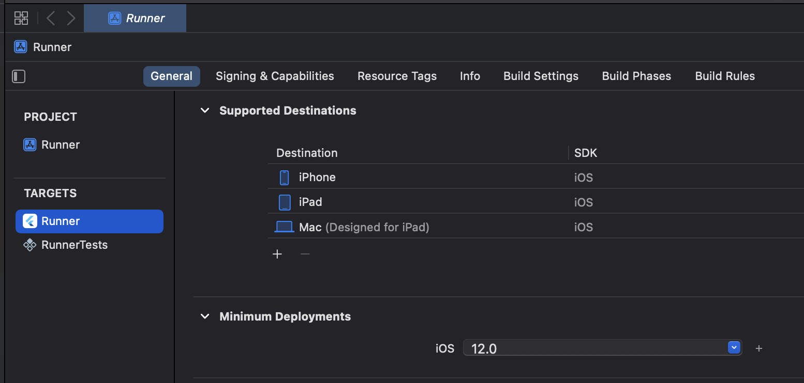
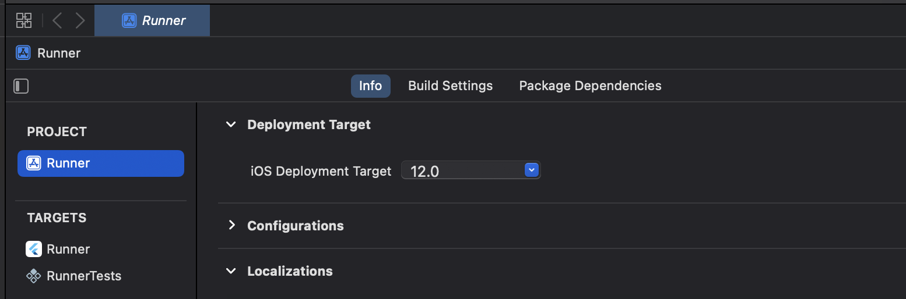

# Troubleshooting: Unable to load contents of file list

This error is caused by a desynchronization between the files generated by `flutter_flavorizr` and
Cocoapods.
Typically, this problem occurs when you try to flavorize your project for the first time, and you
have already run `pod install` before.
Another common scenario is when you try to add a flutter dependency which carries Pods by its own,
and you have already run `pod install` before.
Since `pod install` is called under the hood by Flutter when you run `flutter pub get`, it will
regenerate the Pods, but it will not regenerate the xcfilelis files which are used by XCode to
compile the project.

## Problem

When you run the `flutter run --flavor apple -t lib/main_apple.dart ` command, you get the following
error:

```bash
Xcode build done.
Failed to build iOS app
Error (Xcode): Unable to load contents of file list: '/Target Support Files/Pods-Runner/Pods-Runner-frameworks-Debug-apple-input-files.xcfilelist'
Error (Xcode): Unable to load contents of file list: '/Target Support Files/Pods-Runner/Pods-Runner-frameworks-Debug-apple-output-files.xcfilelist'

Could not build the application for the simulator.
Error launching application on iPhone 15 Pro Max.
```

## Solution

First, we need to clean the project. To do so, run the following command:

```bash
flutter clean
```

Then, we need to manually deintegrate the pods from the project. To do so, run the following
command:

```bash
cd ios && pod deintegrate
```

Make sure that `ios/Pods`, `ios/.symlinks` folder and `ios/Podfile.lock` file have been removed. If
not, remove it manually by running.

```bash
rm -rf ios/Pods ios/.symlinks ios/Podfile.lock
```

Before running `pod install` again, we need to make sure that the XCode Workspace is targeting at
least iOS 12.0. To do so, open the `ios/Runner.xcworkspace` file with XCode, and select the `Runner`
project in the left panel. Then, select the `Runner` target, and go to the `General` tab. In
the `Minimum Deployments` section, make sure that the `Deployment Target` is set to at least `12.0`.



Also, you need to make sure that the `Runner` target is selected in the `Runner` project. To do so,
open the `ios/Runner.xcworkspace` file with XCode, and select the `Runner`
project in the left panel. Then, select the `Runner` project, and go to the `Info` tab. In
the `iOS Deployment Target` section, make sure that the `Deployment Target` is set to at
least `12.0`.



This will ensure that XCode will use the newer linking behavior introduced for iOS 12.0.

Now we're ready to run `flutter pub get` again in order to regenerate the Pods. To do so, run the
following command:

```bash
flutter pub get
```

Finally, we can run the `flutter run --flavor apple -t lib/main_apple.dart ` command again, and the
app should run properly.

This is the proper way to really fix this problem. Other workarounds may work because they are
basically regenerating the Pods as a side effect. However, they are not guaranteed to work, and
they may cause other problems in the future, especially during the deployment phase of the
artifacts.

## macOS

This problem may also occur on macOS. The solution is the same, but you need to run the commands
from the root of the project, and you need to replace `ios` with `macos` in the commands and target
a higher version of macOS. Typycally, you need to target at least `11` for the `macos` target to
solve this problem.